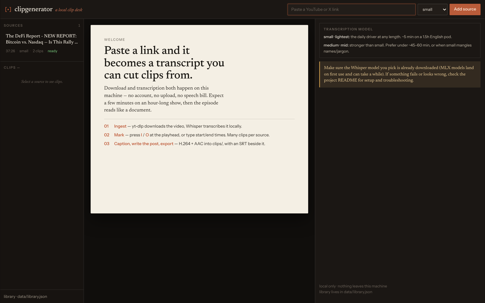
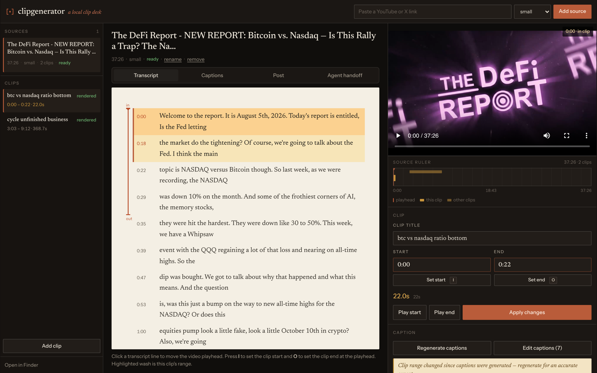
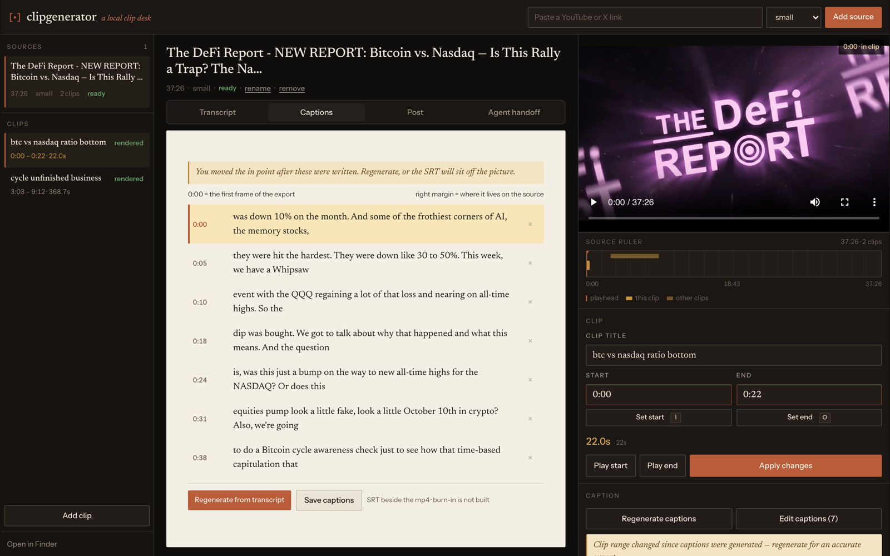
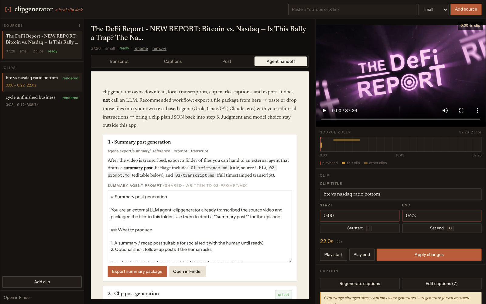

<p align="center">
  
</p>

# clipgenerator

**Local multi-clip studio** for long YouTube and X videos: download → on-device transcription → mark in/out against a live transcript → export clean H.264+AAC clips (optional SRT captions).

No cloud speech bill. No accounts. No multi-tenant hosting. Runs on **your machine** (Apple Silicon recommended for MLX Whisper).

```text
URL → yt-dlp download → MLX Whisper STT → multi-clip editor → export clips/
```

| | |
|--|--|
| **UI** | http://127.0.0.1:5173 (Vite) |
| **API** | http://127.0.0.1:8787 (FastAPI) |
| **Changelog** | [CHANGELOG.md](CHANGELOG.md) |
| **Design system** | [app/frontend/DESIGN.md](app/frontend/DESIGN.md) |
| **Agent pipeline (optional)** | [prompts/AGENT_PIPELINE.md](prompts/AGENT_PIPELINE.md) |
| **Repo policy** | [docs/PUBLIC_REPO.md](docs/PUBLIC_REPO.md) |

---

## Screenshots

### Welcome desk



### Editor — transcript + clip craft



### Captions



### Agent handoff (optional)



---

## Two ways to use it

### 1. Editor workflow (default for most people)

Mark clips yourself from the transcript. Best when you already know the moments you want.

1. **Ingest** a YouTube or X URL (download + local Whisper).
2. **Play** the source; click transcript lines to seek.
3. **Mark** start/end with **I** / **O**, typed times, or Set start / Set end.
4. Optionally **Generate captions** → edit in the Captions tab.
5. **Export clip** → `videos/…/clips/*.mp4` (+ `.srt` if captions exist).

### 2. Agent workflow (optional)

Use an **external** LLM (Grok, ChatGPT, Claude, etc.) for editorial judgment. clipgenerator never calls an LLM itself — it only exports markdown packages and imports a lean clip-plan JSON.

```text
Ingest → Agent handoff:
  1) Export summary package (+ optional brief)
  2) Draft / publish a summary post; paste its URL
  3) Export clip package → refine in your LLM
  4) Import clip-plan JSON
→ Editor: trim, captions, encode
```

Full steps: [prompts/AGENT_PIPELINE.md](prompts/AGENT_PIPELINE.md). Schema: [prompts/CLIP_PLAN_SCHEMA.example.json](prompts/CLIP_PLAN_SCHEMA.example.json).

Enable the **Agent handoff** tab:

```bash
# On by default when you use serve.sh
./scripts/serve.sh

# Editor-only (hide Agent handoff)
CLIPGENERATOR_AGENT_FLOW=0 ./scripts/serve.sh
```

Brand-specific system prompts stay **out of this repo** — keep them in gitignored `prompts/private/` or only inside your LLM project. See [prompts/private/README.md](prompts/private/README.md).

---

## Prerequisites

| Tool | Why | Install (macOS) |
|------|-----|-----------------|
| **macOS + Apple Silicon** | MLX Whisper is optimized for M-series | — |
| **Homebrew** | Installs CLI tools | [brew.sh](https://brew.sh) |
| **yt-dlp** | Download YouTube / X | `brew install yt-dlp` |
| **ffmpeg** | Normalize + export H.264/AAC | `brew install ffmpeg` |
| **Python 3.10+** | API + Whisper | system or `brew install python` |
| **Node.js 18+** | Vite UI | `brew install node` |

Linux/Windows: the download/export scripts may work, but **local MLX Whisper expects Apple Silicon**. Other STT backends are not wired up yet.

---

## Install

```bash
git clone https://github.com/victorkung/clipgenerator-public.git
cd clipgenerator-public

# Python env + deps (includes mlx-whisper)
python3 -m venv .venv
source .venv/bin/activate
pip install -r requirements.txt

# Frontend
cd app/frontend && npm install && cd ../..

# Optional local config (never commit .env)
cp .env.example .env
```

### Local Whisper (MLX) — what actually gets installed

Speech-to-text is **on-device** via [`mlx-whisper`](https://github.com/ml-explore/mlx-examples/tree/main/whisper):

1. `pip install -r requirements.txt` installs the Python package.
2. The **first** transcription downloads model weights from Hugging Face (MLX community repos). That can take several minutes and needs disk space + network.
3. Later runs reuse the cache (default Hugging Face cache, or `MODEL_DIR` / `HF_HOME` in `.env`).

**UI / API models (daily driver):**

| Model | Use when |
|-------|----------|
| **`small` (default)** | Any length. Fast enough for long English pods on M-series. |
| **`medium`** | Harder audio / names / jargon; prefer shorter shows (~≤45–60 min). |

CLI (`scripts/transcribe.py`) still accepts heavier sizes (`turbo`, `large-v3`, …) if you need them.

Optional cache on an external drive — edit `.env`:

```bash
MODEL_DIR=/path/to/your/model-cache
# or
HF_HOME=/path/to/your/model-cache
```

No cloud STT API key is required on the happy path.

---

## Quick start

**Terminal 1 — API** (keep running):

```bash
./scripts/serve.sh
# → http://127.0.0.1:8787
# Do not use RELOAD=1 while long downloads/STT are running.
```

**Terminal 2 — UI**:

```bash
cd app/frontend && npm run dev
# → http://127.0.0.1:5173  (proxies /api → :8787)
```

Then in the browser:

1. Paste a YouTube or X URL → **Add source**.
2. Wait until status is **ready** (download + Whisper).
3. Check **duration** — some X posts are short **promo clips**, not the full episode.
4. Mark clips, optional captions, export.

### Editing cheatsheet

| Action | How |
|--------|-----|
| Set start | Playhead → **Set start**, key **I** |
| Set end | Playhead → **Set end**, key **O** |
| Type times | Start/End fields → Enter or **Apply** |
| Seek from transcript | Click a line |
| Captions | **Generate captions** → Captions tab |
| Agent packages | Agent handoff tab → export / import |
| New clip on same source | **Add clip** |
| Open exports | **Open in Finder** |

**Caption note:** You scrub the **source** video. Captions are stored **relative to the clip start** so they match the exported file. If you change in/out after generating, regenerate captions. Burn-in onto the video is not implemented yet (SRT sidecar only).

---

## CLI (headless)

```bash
./scripts/download.sh "https://x.com/user/status/…"
./scripts/transcribe.sh "videos/….mp4"                 # default: small
./scripts/transcribe.sh --model medium "videos/….mp4"
./scripts/download.sh --with-subs "https://www.youtube.com/watch?v=…"
```

---

## Folder layout

The date prefix is the **ingest / posting day** (when you download), not the original publish date.

```text
videos/
  2026-08-06 Show Name/
    source.mp4
    source.audio.m4a
    source.transcript.json
    source.transcript.txt
    agent-export/              # optional Agent handoff packages
      summary/
      clip/
    clips/
      my-clip-abc123.mp4
      my-clip-abc123.srt
```

Library sidebar state: gitignored `data/library.json`. Media: gitignored `videos/`.

Removing a source from the UI drops the library row only — files on disk are kept.

---

## Project layout

```text
clipgenerator/
├── scripts/             # download, transcribe, serve
├── app/
│   ├── backend/         # FastAPI: ingest, clips, export, agent packages
│   └── frontend/        # Vite + React (Desk theme)
├── brand/               # logo, marks, favicons (source of truth)
├── prompts/             # public agent-pipeline docs + clip-plan schema
│   └── private/         # your packs only (gitignored) — see private/README.md
├── docs/                # design notes + README screenshots
├── config/yt-dlp.conf
├── data/                # library.json (gitignored)
└── videos/              # media (gitignored)
```

---

## Public repo policy (single repo)

This project is meant to be **one public daily-driver repository**. Anyone can clone and run it; keep personal material out of git.

| Commit | Do not commit |
|--------|----------------|
| App source, scripts, public prompts, brand, docs, screenshots | `.env` (API keys / local paths) |
| `.env.example` with placeholders only | `videos/`, `data/` |
| Generic `prompts/` pipeline docs | `prompts/private/**` (except its public README) |
| | `.venv/`, `node_modules/`, transcripts, audio sidecars |

Details and checklist: **[docs/PUBLIC_REPO.md](docs/PUBLIC_REPO.md)**.

Private editorial packs: keep them local under gitignored `prompts/private/` (or only inside your LLM product). The app does not load them at runtime.

---

## Troubleshooting

| Issue | Fix |
|-------|-----|
| `mlx-whisper is not installed` | `source .venv/bin/activate && pip install -r requirements.txt` |
| First STT is slow | Model weights downloading; later runs use cache. Prefer `small`. |
| STT / download dies mid-job | Don’t run `RELOAD=1` on the API while jobs run |
| Fans / heat on long pods | Normal under MLX; plug in |
| UI can’t reach API | `./scripts/serve.sh` on 8787; Vite on 5173 |
| Export silent / broken audio | Re-export (libx264 + AAC). Delete old bad clip files. |
| Export feels stuck | Watch export progress; long clips re-encode |
| X video is only ~30s | Promo clip — full episode may be on YouTube/Spotify/RSS |

---

## Responsible use

- You are responsible for complying with **YouTube**, **X**, and **copyright** rules for any URL you download or clip you publish.
- Prefer content you own, are licensed to use, or that the platform allows for personal offline use.
- This tool does **not** grant rights to redistribute others’ shows.
- Keep `.env`, `data/`, and `videos/` private (gitignored).
- Localhost only — do not expose the API to the public internet.

---

## Releases

User-facing changes live in **[CHANGELOG.md](CHANGELOG.md)** (`Added` / `Changed` / `Fixed`).

```bash
git tag -a v0.3.0 -m "v0.3.0 — desk UI + public packaging"
git push origin main --tags
```

---

## Roadmap

| Status | Scope |
|--------|--------|
| **Shipped** | Local Whisper, multi-clip UI, captions + SRT, agent package export/import, Desk design system |
| **Later** | Caption burn-in on export, richer publish board, optional schedulers |

## For AI coding agents

Auto-load **[AGENTS.md](AGENTS.md)** first (product map + git rules). Prefer that over re-exploring the tree. Recent changes: `CHANGELOG.md` → `[Unreleased]`.

---

Formerly known in git history as `yt-x-vid-downloader-transcriber`.
